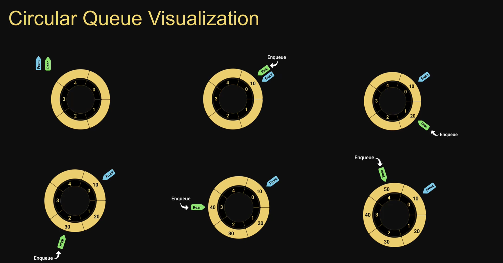

# Circular Queue

the size of the queue is fixed and a single block of memory is used as if the first element is connected to the last element
also referred to as curcular buffer or ring buffer and follows the FIFO principle
a circualr queue will reuse the empty block created during the dequeue operation
when working with queues of fixed maximum size, a circular queue is a great implementation choice
the circular queue data structure supports two main operations

1. Enqueue, which adds an element to the rear/tail of the collection
2. Dequeue, which removes an element from the front/head of the collection

# Enqueue visualization

# Dequeue visualization

# Circular queue usage

Clock
Streaming data
Traffic lights
