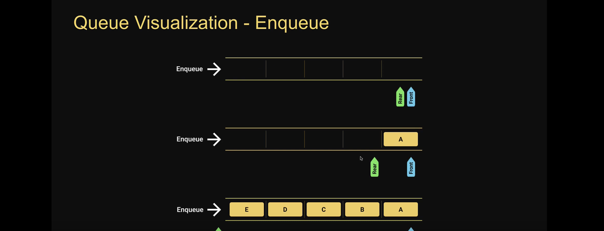
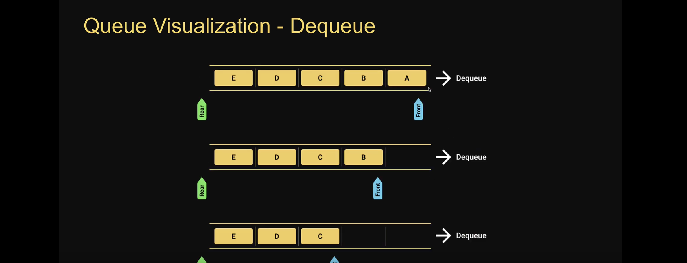

# Queue

The queue data structure is a sequential collection of elements that follows the principle of First In First Out (FIFO)
The first element inserted into the queue is first element to be removed
A queue of peeople. People enter the queue at one end (rear/tail) and leave the queue from the other end (front/head)
Queue is an abstract data type. It is defined by its behavior rather than being a mathematical model
The queue data structure support two main operations

1. Enqueue, which add an element to the rear/tail of the collection
2. Dequeue, which removes an element from the front/head of the collection

# Enqueue visualization

# Dequeue visualization

# Queue usage

1. Printers
2. CPU Task Scheduling
3. Callback queue in javascript runtime
