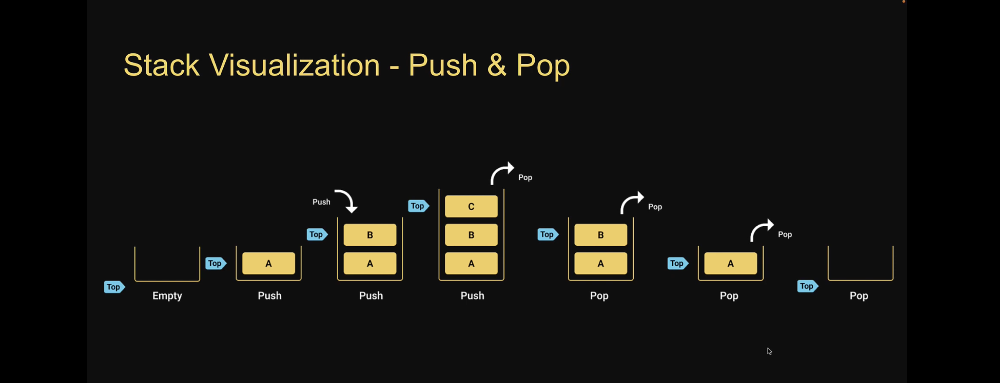

# Stack

the stack data structure is a sequential collection of elements that follows the principle of Last In First Out (LIFO)
the last element inserted into the stack is first element to be removed
A stack of plates. The last plate placed on the top of the stack is also the first plate removed from the stack
Stack is an abstract data type. it is defined by its behavior rather than being a mathematical model
The stack data structure supports two main operations

1. Push, which adds an element to the collection
2. Pop, which removes the most recently added element from the collection

Stack visualization

# Stack Usage

Browser history tracking
Undo operation when typing
Expression conversions
Call stack in Javascript Runtime
