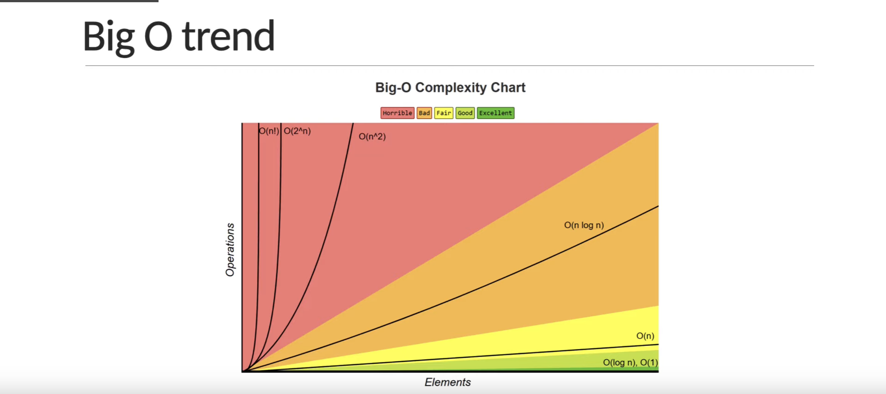

- Algorithm
- Measuring performance
- Time and Space Complexity
- Big O Notation
- Math Algorithm
- Sort
- Search
- Misc. Algorithm and problem solving

# What is Algorithm

An Algorithm is a set of well-defined instructions to solve a particular problem

# Characteristic

Well defined inputs and outputs
Each step should be clear and unambiguos
Language independent

Sample - The sum of a number

input -> Algorithm -> output

Two numbers (a, b) -> Add number using '+', Return the value -> Sum of 'a' and 'b'

# Why Algorithm

As a developer, you're going to come across problem that you need to solve
Learning Algorithm translates to learning different techniques to efficiently solve those problem
One problem can be solved in many ways using different Algorithm
Every Algorithm comes with its own tradeoffs when it comes to performance

# Algorithm analysis

There are multiple ways to solve one problem
Ex: There are multiple algorithm to sort a list of numbers

Generally, when we talk about performance, we use an absolute measure

# Algorithm analysis contd

We evaluate the performance of an algorithm in terms of its input size
The evaluation is of two types:

1. Time complexity - Amount of time taken by an algorithm to run, as a function of input size
2. Space complexity - Amount of memory taken by an algorithm to run, as a function of input size

By evaluating against the input size, the analysis is not only machine independent but the comparison is also more appropriate
Ex: imagine if one algorithm is faster then other for a small input size but slower for a larger input size

There is no one solution that works every single time. It is always good to know multiple ways to solve the problem and use the best solution, given your constraints

- If your app needs to be very quick and has plenty of memory to work with, you dont have to worry about space complexity

- If you have very little memory to work with, you should pick a solution that is relatively slower but need less space

# How to represent the complexity

## Asymptotic notations

- Mathematical tools to represent time and space complexity
  1. Big-O Notation (O-Notation) - Worst case complexity
  2. Omega notation (Ω-Notation) - Best case complexity
  3. Theta notation (θ-Notation) - Average case complexity

# Big-O Notation

The worst case complexity of an algorithm is represented using the Big-O notation

Big-O notation describe the complexity of an algorithm using algebraic terms
it has two important characteristic:

1.  It is expressed in terms of the input
2.  It focuses on the bigger picture without getting caught up in the minute details

# Big-O Time Complexity


### Code Sample

```javascript
function summation(n) {
  let sum = 0;
  for (let i = 1; i <= n; i++) {
    sum += i;
  }
  return sum;
}
```

Time Complexity: O(n) - Linear
Means: as the size of the input increases the time complexity also increases

# Big-O Calculation


```Javascript
function summation(n) {
    return (n * (n + 1)) / 2
}
```

the time complexity of this algorithm os O of one which is called constant time complexity
Time complexity: O(1) - Constant

Example:
if there are two nested loops, the time complexity is quadratic: O(n²) - Quadratic | 3n² + 5n + 1


if there are three nested loops, the time complexity is cubic: O(n³) - Cubic
if the input size reduces by half every iteration, the time complexity is Logarithmic: O(logn) - Logarithmic

# Space Complexity

O(1) - Constant: if the algorithm does not need extra memory, or the memory needed does not depend on the input size the space complexity is constant, and example would be sorting algorithms which sort within the array without utilizing additional arrays

O(n) - Linear: algorithm with linear space complexity where the extra space needed grows as the input size grows
O(logn) - Logarithmic: the extra space needed grows but not as the same rate as the input size

typically we would find algorithms with these three space complexities

Big-O Trend


# Note

- Multiple algorithms exist for the same problem and there is no one right solution. Diffrent algorithms work well under different constraints.
- The same algorithm with the same programming language can be implemented in different ways.
- When writing programs at work, dont's lose sight of the big picture. Rather than writing clever code, write code that is simple to read and maintain.
